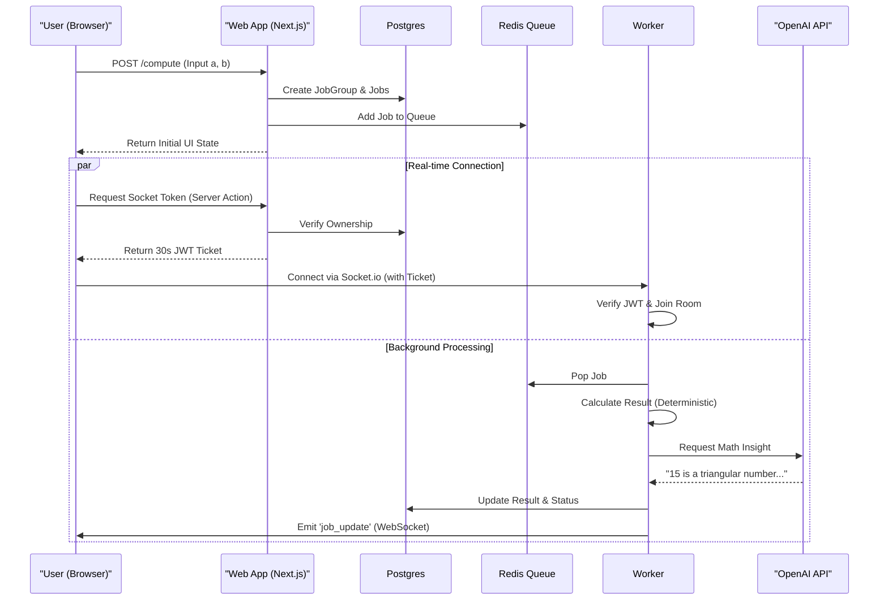
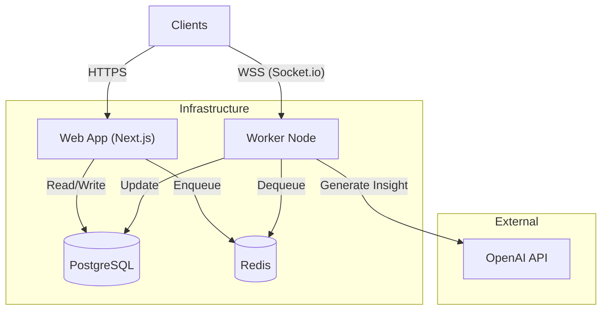

# Emma Distributed Calculator

## 🚀 Introduction

**Emma Distributed Calculator** is a high-performance, distributed computing SaaS designed to handle complex calculation workloads combined with AI-generated insights. Unlike a traditional monolithic web app, this project decouples the **user-facing interface** from the **compute-heavy backend**, allowing for massive scalability and real-time feedback.

**What makes this powerful?**
- **Distributed Architecture**: Long-running or heavy tasks are offloaded to a dedicated worker fleet, preventing the web server from blocking.
- **Hybrid Intelligence**: Combines deterministic mathematical precision with probabilistic AI creativity (OpenAI) to provide "math insights" alongside raw results.
- **Real-time Synchronization**: Uses WebSockets (Socket.io) to push progress updates instantly to the user's dashboard, providing a "living" UI experience.
- **Enterprise-Grade SaaS Setup**: Built with multi-user support in mind—users have their own isolated job history and secure authentication.

---

## 🏗 Architecture & Design Choices

This project is built as a **Turborepo Monorepo**, ensuring code sharing and optimized build times.

### 🧩 System Components

1.  **`apps/web` (The Interface)**
    *   **Tech**: Next.js 14, React, Tailwind CSS, Radix UI.
    *   **Role**: Handles user authentication, dashboard UI, and submitting job requests.
    *   **Reasoning**: Next.js provides server-side rendering for performance and SEO, while React guarantees a snappy, interactive dashboard.

2.  **`apps/worker` (The Brain)**
    *   **Tech**: Node.js, BullMQ, OpenAI SDK, Socket.io.
    *   **Role**: Consumes jobs from the Redis queue, performs calculations, queries the LLM for insights, and broadcasts real-time status updates.
    *   **Reasoning**: Keeping workers separate allows them to be scaled independently. If compute demand spikes, we can spin up 100 worker containers without adhering to web traffic patterns.

3.  **`packages/database` (The Source of Truth)**
    *   **Tech**: Prisma ORM, PostgreSQL.
    *   **Role**: Shared database schema and client. Defines `User`, `JobGroup`, and `Job` models.

4.  **Infrastructure Services**
    *   **Redis**: Powers the BullMQ job queue and Pub/Sub events.
    *   **PostgreSQL**: Persistent storage for user data and job history.

### 🔄 The Flow
1.  **User** logs in and submits a calculation request (e.g., "Add 5 + 10") on the web dashboard.
2.  **Web App** saves a `JobGroup` in Postgres and adds a job to the **Redis Queue**.
3.  **Worker** picks up the job immediately from Redis.
4.  **Worker** processes the math (deterministic) then calls **OpenAI** (LLM) to generate a fun fun fact about the result.
5.  **Worker** updates Postgres with the result and status.
6.  **Worker** emits a `job_update` event via Socket.io.
7.  **Web Dashboard** listens to the socket event and updates the UI in real-time without a page refresh.

---

## ⚙️ How to Run

### Local Development

1.  **Prerequisites**: Node.js (v20+), Docker (for DBs).

2.  **Environment Variables**:
    - Copy `.env.example` to `.env` in `apps/web`, `apps/worker`, and `packages/database` and fill in your secrets:
      ```bash
      cp apps/web/.env.example apps/web/.env
      cp apps/worker/.env.example apps/worker/.env
      cp packages/database/.env.example packages/database/.env
      ```
3.  **Start Infrastructure**:
    ```bash
    docker-compose up -d
    # Starts Postgres (5432) and Redis (6379)
    ```
4.  **Install & Generate**:
    ```bash
    npm install
    # db:generate creates the Prisma Client (TypeScript types)
    npx turbo run db:generate
    # db:deploy applies the generated migrations to the local database
    npx turbo run db:deploy
    ```
5.  **Run the Monorepo**:
    ```bash
    npm run dev
    ```
    - Web: `http://localhost:3000`
    - Worker: `http://localhost:3001`

### Production Deployment (DigitalOcean)

This project is configured for **DigitalOcean App Platform** using Docker containers.

1.  **CI/CD Pipeline** (`.github/workflows/deploy.yml`):
    - **Test & Lint**: Runs on every push to `main`.
    - **Build & Push**: Builds optimized Docker images for `web` and `worker` and pushes them to DigitalOcean Container Registry (DOCR).
    - **Deploy**: Updates the App Platform spec to pull the new images.

2.  **Infrastructure**:
    - Managed PostgreSQL & Redis (DigitalOcean).
    - App Platform runs two components: `web` (HTTP service) and `worker` (Background worker).

---

## 🛡 Security & User System

This project implements a **robust, multi-layered security model** designed for a multi-user SaaS environment.

### 🔐 Authentication & Short-Lived Tokens
- **Secure Sessions**: Powered by **NextAuth.js v5**, using HTTP-only secure cookies and session management.
- **Socket Authorization (Critical)**:
    - WebSockets are stateless and vulnerable to unauthorized access.
    - We solve this with **Short-Lived JWT Tickets**:
        1. When a user opens a job group on the dashboard, the client requests a "handshake token" via a secure Server Action (`authorizeSocketConnection`).
        2. The server verifies **ownership** (does this user own this job group?) and signs a **30-second JWT** ticket.
        3. The client passes this ticket during the Socket.io handshake.
        4. The Worker validates the ticket signature and expiration before allowing the user to join the real-time room.
    - This ensures that even if someone guesses a job group ID, they cannot listen to updates without being authenticated and authorized.

### 🏢 SaaS & Multi-User Architecture
- **Data Isolation**: Every `JobGroup` and `Job` is strictly scoped to a `User`. The Prisma schema dictates that users can only query their own data.
- **Persistent History**: Unlike simple demos, this app retains full calculation history per user, allowing them to revisit past jobs and insights.

---

## 📊 Architectural Diagrams

### Flow: Job Submission & Real-time Updates



### System Overview




---

## 🤖 Technical Feats & AI Insights

- **BullMQ Integration**: Robust job queue handling with retries, failed job tracking, and concurrency management (currently set to process 4 jobs in parallel).
- **AI "Flavor"**:
    - Every calculation isn't just a number. The worker sends the result to **GPT-3.5-Turbo** or **GPT-4o-mini**.
    - The LLM acts as a "Mathematician" persona, generating a unique property about the number (e.g., "15 is a triangular number...").
- **Optimized Builds**:
    - Uses `turbo prune` in Dockerfiles (implied) to create minimal Docker images, including only necessary package dependencies for each app, significantly reducing image size and attack surface.

---

## 📏 Code Quality & Testing Standards

High code quality and reliability are core pillars of this project.

- **Strict Linting**: We use a comprehensive ESLint configuration across the monorepo to ensure consistent code style and best practices. Zero warnings are allowed in CI.
- **Type Safety**: Full TypeScript coverage is enforced. `any` types are strictly forbidden to prevent runtime errors.
- **Input Validation**: All external inputs (API routes, Server Actions) are rigorously validated using **Zod** schemas to ensure system integrity.
- **Testing**:
    - **High Coverage**: We maintain a high bar for test coverage across both `web` and `worker` apps.
    - **Unit & Integration Tests**: Using **Vitest**, we test individual components and complex flows (like socket interactions) to guarantee stability before deployment.
